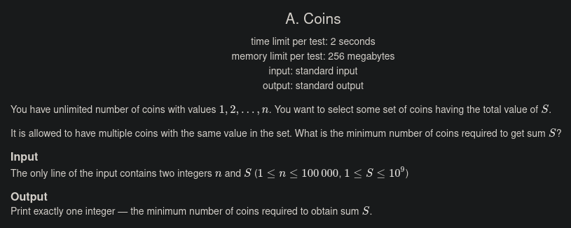
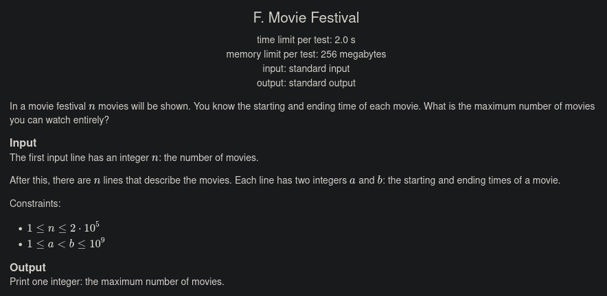
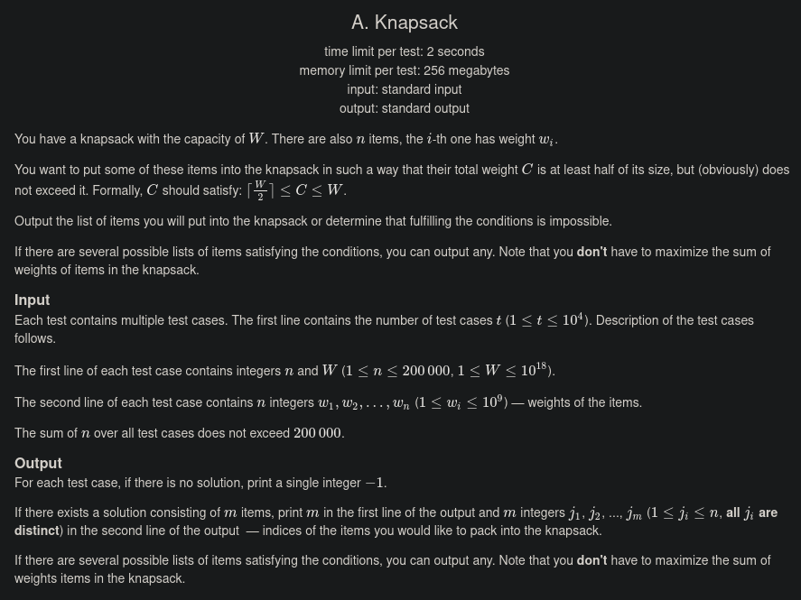
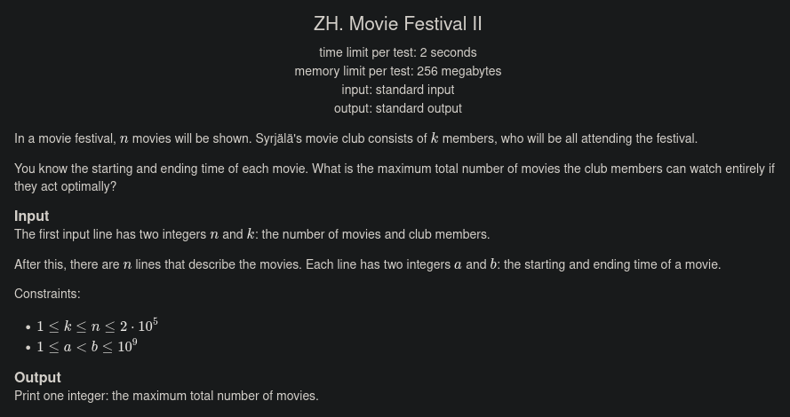
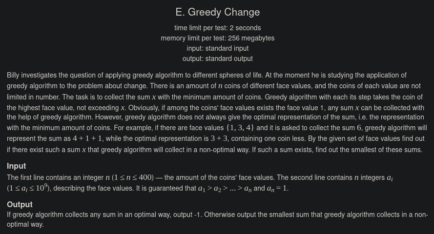

# Greedy Problems Codeforces

**Número da Lista**: 42 
**Conteúdo da Disciplina**: Greed 

## Alunos
|Matrícula | Aluno |
| -- | -- |
| 190058587  |  Matheus Raphael Soares de Oliveira |

## Sobre 
Resolução de exercícios Greedy do Codeforces:
- Iniciante:
    - https://codeforces.com/problemset/problem/1061/A
    - https://codeforces.com/gym/102961/problem/F
- Intermediário:
    - https://codeforces.com/problemset/problem/1446/A
    - https://codeforces.com/gym/102961/problem/ZH
- Avançado:
    - https://codeforces.com/problemset/problem/10/E

## Screenshots
Enunciados dos exercícios:

## Instalação 
**Linguagem**: C++ 
Necessário ter um compilador C++ para rodar localmente (no Linux ou WSL),

    g++ nomedoarquivo.cpp
    ./a.out

ou acessar algum compilador C++ online.

> Alternativa: Só subir o código para os problemas no Codeforces para o julgamento.

## Uso 
Após rodar o código, teste com os casos de exemplo presentes na página do exercício, ou submeta o código para o julgamento.